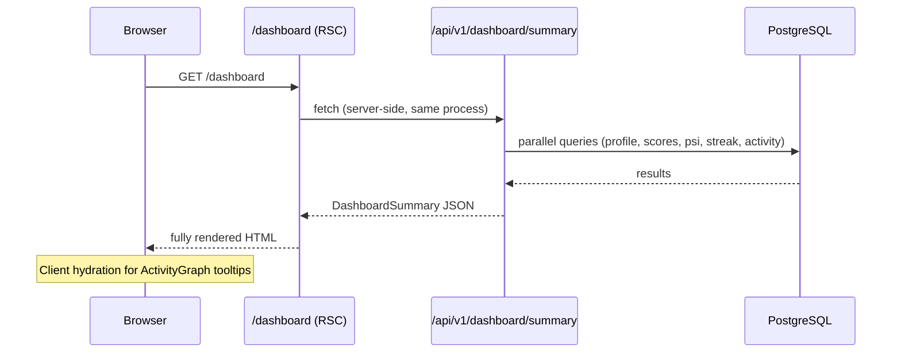
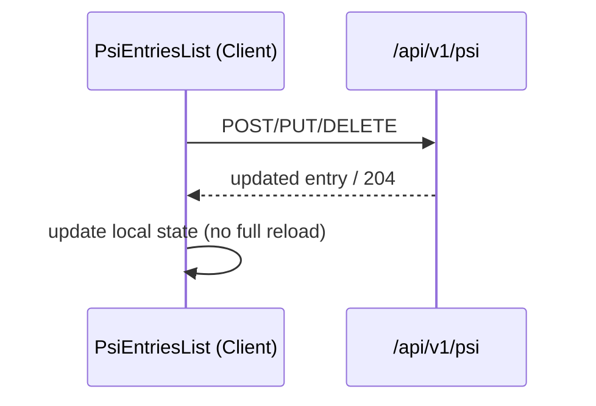

# Dashboard Feature — Design Document

## Overview

The Dashboard is the authenticated home base of the PM Career Navigation Platform. It aggregates a user's readiness score, skill breakdown, skill gaps, PSI work experiences, streak, and activity history into a single server-rendered page. A sub-page at `/dashboard/psi` provides full CRUD for PSI entries.

The design follows the "Methodical Architect / Quiet Authority" aesthetic: tonal layering instead of borders, Inter typography, indigo primary (#3525cd), amber secondary, glassmorphism for floating elements, and no gamification patterns.

### Key Design Decisions

- **Server Components first**: The main dashboard page is a React Server Component that fetches all data in a single `GET /api/v1/dashboard/summary` call, enabling fast SSR with no client-side loading spinners for the initial render.
- **Client islands for interactivity**: The Activity Graph tooltip, PSI inline edit forms, and the streak widget are Client Components hydrated after the initial paint.
- **Soft delete for PSI**: Deletion sets `is_visible = false` rather than hard-deleting, preserving data integrity and enabling future undo.
- **Live score calculation**: When no `readiness_score_snapshots` record exists, the score is computed on-the-fly from `user_skill_scores` rather than erroring.

---

## Architecture

```
/dashboard (Server Component — page.tsx)
  │
  ├── onboarding guard (middleware or server-side redirect)
  │
  ├── fetch: GET /api/v1/dashboard/summary
  │     └── returns: profile, readiness, topGaps, topStrengths,
  │                  psiSummary, streak, activityLogs
  │
  ├── ReadinessScoreWidget       (Server Component)
  ├── SkillBreakdown             (Server Component)
  ├── SkillGapsPanel             (Server Component)
  ├── PsiSummaryWidget           (Server Component)
  ├── StreakWidget                (Server Component)
  └── ActivityGraph              (Client Component — needs hover/tooltip)

/dashboard/psi (Server Component — page.tsx)
  │
  ├── fetch: GET /api/v1/psi
  │
  └── PsiEntriesList             (Client Component — inline edit/add/delete)
        └── PsiEntryCard         (Client Component)

/api/v1/dashboard/summary        (Route Handler)
/api/v1/psi                      (Route Handler — GET, POST)
/api/v1/psi/[id]                 (Route Handler — PUT, DELETE)
```

### Data Flow



For PSI mutations, the client calls the API directly and updates local React state optimistically:



---

## Components and Interfaces

### Page Components

#### `src/app/dashboard/page.tsx`
Server Component. Reads session, calls the summary API, passes data to widgets. Handles the onboarding guard redirect.

```typescript
// Props: none (reads session server-side)
// Redirects to /login if unauthenticated
// Redirects to onboarding step URL if onboardingCompleted === false
// Renders empty state if onboardingCompleted && no skill scores
```

#### `src/app/dashboard/psi/page.tsx`
Server Component. Fetches all visible PSI entries, renders `PsiEntriesList`.

### Widget Components

#### `ReadinessScoreWidget`
Path: `src/components/dashboard/readiness-score-widget.tsx`
Server Component.

```typescript
interface ReadinessScoreWidgetProps {
  score: number;           // 0-100 integer
  targetRoleType: string | null;
}
```

Renders a circular SVG progress ring using stroke-dasharray/stroke-dashoffset. The ring uses `--color-primary` fill. Score >= 70 shows amber "You're ready to apply" CTA; score < 70 shows subdued "Apply when you reach 70" note.

#### `SkillBreakdown`
Path: `src/components/dashboard/skill-breakdown.tsx`
Server Component.

```typescript
interface SkillBreakdownProps {
  categories: Array<{
    name: string;
    score: number; // 0-100
  }>;
}
```

Sorted ascending by score. Color logic: score < 30 → `--color-secondary` (amber), 30–50 → `--color-outline-variant` (gray), > 50 → `--color-primary` (indigo). No dividers — vertical spacing only (`gap-3`).

#### `SkillGapsPanel`
Path: `src/components/dashboard/skill-gaps-panel.tsx`
Server Component.

```typescript
interface SkillGapsPanelProps {
  gaps: Array<{
    categoryName: string;
    score: number;
    explanation: string; // role-specific, 1-2 sentences
    learningHref: string;
  }>;
}
```

Always shows 2–3 entries (the lowest-scoring categories regardless of absolute value). Each card: category name, score badge, explanation text, "Start improving →" link.

#### `PsiSummaryWidget`
Path: `src/components/dashboard/psi-summary-widget.tsx`
Server Component.

```typescript
interface PsiSummaryWidgetProps {
  totalCount: number;
  previews: Array<{
    id: string;
    problemPreview: string; // truncated to 120 chars
  }>;
}
```

Shows count, 2 preview cards, "View all experiences →" link to `/dashboard/psi`.

#### `StreakWidget`
Path: `src/components/dashboard/streak-widget.tsx`
Server Component.

```typescript
interface StreakWidgetProps {
  currentStreak: number;
  longestStreak: number;
  lastActiveDate: Date | null;
  totalDaysActive: number;
}
```

Hidden entirely when `currentStreak === 0 && totalDaysActive === 0`. Displays relative date string (e.g., "Active today", "Last active 2 days ago") computed server-side.

#### `ActivityGraph`
Path: `src/components/dashboard/activity-graph.tsx`
Client Component (`"use client"`).

```typescript
interface ActivityGraphProps {
  // 84 entries (12 weeks × 7 days), keyed by ISO date string
  activityByDay: Record<string, number>;
}
```

Renders a 12×7 grid of day cells. Color tiers: 0 → `bg-surface-container`, 1–2 → `bg-primary/20`, 3–5 → `bg-primary/50`, 6+ → `bg-primary`. Tooltip on hover shows date + count. Day labels (M, W, F) on left axis; month labels on top axis.

#### `PsiEntriesList`
Path: `src/components/dashboard/psi-entries-list.tsx`
Client Component.

```typescript
interface PsiEntriesListProps {
  initialEntries: PsiEntryWithSkills[];
}

interface PsiEntryWithSkills {
  id: string;
  problem: string;
  solution: string;
  impact: string;
  createdAt: string;
  skillMappings: Array<{ skillName: string; categoryName: string }>;
}
```

Manages local state for the entry list. Handles add (blank form), inline edit (pre-populated form), and delete (optimistic removal). Each mutation calls the PSI API and updates state on success.

---

## Data Models

### Dashboard Summary Response

```typescript
interface DashboardSummary {
  profile: {
    fullName: string | null;
    targetRoleType: string | null;
    onboardingCompleted: boolean;
  };
  readiness: {
    overall: number; // 0-100, rounded integer
    byCategory: Record<string, number>; // categorySlug → score
  };
  topGaps: Array<{
    categorySlug: string;
    categoryName: string;
    score: number;
    explanation: string;
  }>;
  topStrengths: Array<{
    categorySlug: string;
    categoryName: string;
    score: number;
  }>;
  psiSummary: {
    totalCount: number;
    previews: Array<{ id: string; problemPreview: string }>;
  };
  streak: {
    currentStreak: number;
    longestStreak: number;
    lastActiveDate: string | null; // ISO date
    totalDaysActive: number;
  } | null;
  activityByDay: Record<string, number>; // ISO date → count, last 84 days
}
```

### PSI Entry (API)

```typescript
interface PsiEntryResponse {
  id: string;
  problem: string;
  solution: string;
  impact: string;
  isVisible: boolean;
  createdAt: string;
  updatedAt: string;
  skillMappings: Array<{
    skillId: string;
    skillName: string;
    categoryName: string;
    evidenceScore: number;
  }>;
}

interface PsiCreateRequest {
  problem: string;  // non-empty
  solution: string; // non-empty
  impact: string;   // non-empty
}

type PsiUpdateRequest = PsiCreateRequest;
```

### Onboarding Step → URL Mapping

```typescript
const ONBOARDING_STEP_URLS: Record<number, string> = {
  0: '/onboarding/upload',
  1: '/onboarding/profile',
  2: '/onboarding/analyzing',
  3: '/onboarding/conversation',
  4: '/onboarding/summary',
};
```

### Score Calculation

The readiness score is computed from `user_skill_scores` joined with `skills`, `skill_categories`, and `role_weights`:

```
Skill_Score(s)     = 0.5 × evidence_score + 0.3 × assignment_score + 0.2 × learning_score
Category_Score(c)  = avg(Skill_Score for all skills in category c)
Readiness_Score    = Σ (Category_Score(c) × role_weight(c, targetRole)) for all categories
```

When no `user_pm_targets` record exists, role weights are omitted and the score is a simple average of all category scores.

### Gap Explanation Map

Static per-role explanations are stored as a constant map in the API layer (not in the DB for MVP):

```typescript
// src/lib/gap-explanations.ts
type GapExplanations = Record<string, Record<string, string>>;
// gapExplanations[roleType][categorySlug] = "explanation text"
```

---

## Correctness Properties

*A property is a characteristic or behavior that should hold true across all valid executions of a system — essentially, a formal statement about what the system should do. Properties serve as the bridge between human-readable specifications and machine-verifiable correctness guarantees.*

### Property 1: Onboarding guard redirects to correct step

*For any* authenticated user whose `onboardingCompleted` is `false`, the dashboard guard should redirect to the URL corresponding to `onboardingStep` in the step-to-URL mapping, and that URL should never be `/dashboard`.

**Validates: Requirements 1.1**

---

### Property 2: Score widget renders correct score and role label

*For any* readiness score in [0, 100] and any target role type string, the `ReadinessScoreWidget` rendered output should contain the integer score value and the role type label.

**Validates: Requirements 2.1, 2.2**

---

### Property 3: Score threshold CTA is mutually exclusive

*For any* readiness score in [0, 100], the widget should display exactly one of the two CTA variants: "You're ready to apply" when score ≥ 70, and "Apply when you reach 70" when score < 70 — never both, never neither.

**Validates: Requirements 2.3, 2.4**

---

### Property 4: Readiness score formula correctness

*For any* set of `user_skill_scores` records and `role_weights`, the computed `Readiness_Score` should equal `Σ (avg(0.5×evidence + 0.3×assignment + 0.2×learning) × role_weight)` for all categories, rounded to the nearest integer.

**Validates: Requirements 2.5**

---

### Property 5: Skill breakdown sort order

*For any* list of skill categories with scores, the `SkillBreakdown` component should render them in non-decreasing order of score (ascending), so the lowest-scoring category always appears first.

**Validates: Requirements 3.2**

---

### Property 6: Skill breakdown color tier assignment

*For any* category score value, the bar color should be: amber (`--color-secondary`) when score < 30, gray (`--color-outline-variant`) when 30 ≤ score ≤ 50, and indigo (`--color-primary`) when score > 50. These tiers are exhaustive and mutually exclusive.

**Validates: Requirements 3.3, 3.4, 3.5**

---

### Property 7: Gap panel always shows 2–3 lowest categories

*For any* list of skill categories with scores (minimum 2 categories), the `SkillGapsPanel` should always display between 2 and 3 entries, and those entries should be the categories with the lowest scores — regardless of whether any scores are below 50.

**Validates: Requirements 4.1, 4.4**

---

### Property 8: Gap cards contain required fields

*For any* gap category entry, the rendered gap card should contain the category name, a numeric score, an explanation string, and a "Start improving →" link element.

**Validates: Requirements 4.2, 4.3**

---

### Property 9: PSI preview truncation

*For any* PSI entry whose `problem` field exceeds 120 characters, the preview card on the dashboard should display a truncated string of at most 120 characters.

**Validates: Requirements 5.3**

---

### Property 10: PSI list shows only visible entries

*For any* user with a mix of `is_visible = true` and `is_visible = false` PSI entries, the PSI page and the `GET /api/v1/psi` response should contain only entries where `is_visible` is `true`.

**Validates: Requirements 6.1, 10.1**

---

### Property 11: PSI edit form pre-population

*For any* PSI entry, when the edit button is clicked, the inline form fields should be pre-populated with the entry's current `problem`, `solution`, and `impact` values exactly.

**Validates: Requirements 6.2**

---

### Property 12: PSI CRUD round-trip

*For any* valid PSI entry data `{problem, solution, impact}`, the sequence `POST → GET` should return an entry with equivalent field values; and `POST → PUT(newData) → GET` should return an entry with the updated field values.

**Validates: Requirements 6.3, 6.5, 10.2, 10.3, 10.7**

---

### Property 13: PSI delete removes from list

*For any* visible PSI entry, calling `DELETE /api/v1/psi/:id` should result in that entry being absent from the subsequent `GET /api/v1/psi` response.

**Validates: Requirements 6.6, 10.4**

---

### Property 14: PSI skill tags presence

*For any* PSI entry, the rendered card should display skill category tags if `psi_skill_mappings` exist for that entry, and display a "No skills tagged" placeholder if no mappings exist.

**Validates: Requirements 6.7, 6.8**

---

### Property 15: PSI ownership enforcement

*For any* PSI entry belonging to user A, a `PUT` or `DELETE` request authenticated as user B (where B ≠ A) should receive HTTP 403.

**Validates: Requirements 10.5**

---

### Property 16: PSI field validation rejects empty inputs

*For any* `POST` or `PUT` request where at least one of `problem`, `solution`, or `impact` is an empty string or whitespace-only string, the API should return HTTP 400.

**Validates: Requirements 10.6**

---

### Property 17: Activity graph color tier assignment

*For any* day with an activity count, the cell color tier should be: no fill when count = 0, light tint when count ∈ [1, 2], medium tint when count ∈ [3, 5], and full primary color when count ≥ 6. These tiers are exhaustive and mutually exclusive.

**Validates: Requirements 8.2**

---

### Property 18: Dashboard API response shape

*For any* authenticated user (regardless of data completeness), the `GET /api/v1/dashboard/summary` response should contain all required top-level keys: `profile`, `readiness`, `topGaps`, `topStrengths`, `psiSummary`, `streak`, and `activityByDay`.

**Validates: Requirements 9.1**

---

### Property 19: Relative date formatting

*For any* `lastActiveDate` value, the formatted string should be a non-empty human-readable relative description (e.g., "Active today", "Last active N days ago") and should never expose a raw ISO timestamp to the user.

**Validates: Requirements 7.3**

---

## Error Handling

| Scenario | Handling |
|---|---|
| Unauthenticated request to `/dashboard` | Middleware redirects to `/login` |
| `profile` record missing | Redirect to `/onboarding/upload` |
| `onboardingCompleted = false` | Redirect to step URL from `ONBOARDING_STEP_URLS[onboardingStep]` |
| `onboardingCompleted = true` but no skill scores | Render "Analysis still running" empty state with spinner; no score widgets |
| No `user_pm_targets` record | Score computed as simple category average; `targetRoleType` returned as `null` |
| No `readiness_score_snapshots` | Score computed live from `user_skill_scores`; no error |
| No `user_streaks` record | `streak` field in API response is `null`; streak widget hidden |
| No activity logs in past 12 weeks | All cells render with no fill; "Start learning to build your streak" message shown |
| PSI `PUT`/`DELETE` on another user's entry | HTTP 403 Forbidden |
| PSI `POST`/`PUT` with empty fields | HTTP 400 with field-level error message |
| PSI `PUT`/`DELETE` on non-existent ID | HTTP 404 Not Found |
| Dashboard API timeout (> 2000ms) | HTTP 504; client shows stale data or error boundary |
| Database connection failure | HTTP 500; Next.js error boundary renders fallback UI |

---

## Testing Strategy

### Dual Testing Approach

Both unit tests and property-based tests are required. Unit tests cover specific examples, integration points, and edge cases. Property tests verify universal correctness across randomized inputs.

### Property-Based Testing

**Library:** `fast-check` (TypeScript-native, works in Jest/Vitest)

Each property test runs a minimum of 100 iterations. Tests are tagged with a comment referencing the design property.

```typescript
// Feature: dashboard, Property 4: Readiness score formula correctness
it('computes readiness score correctly for any skill scores and weights', () => {
  fc.assert(fc.property(
    fc.array(fc.record({ evidenceScore: fc.float({min:0,max:100}), ... })),
    fc.record({ ... }), // role weights
    (skillScores, weights) => {
      const result = computeReadinessScore(skillScores, weights);
      const expected = /* manual formula */;
      return Math.abs(result - expected) < 0.01;
    }
  ), { numRuns: 100 });
});
```

**Property tests to implement** (one test per property):

| Property | Test file | Pattern |
|---|---|---|
| P1: Onboarding guard redirects | `__tests__/dashboard/guard.test.ts` | Invariant |
| P3: Score threshold CTA | `__tests__/dashboard/readiness-widget.test.ts` | Invariant |
| P4: Score formula | `__tests__/lib/score-calculator.test.ts` | Model-based |
| P5: Skill breakdown sort | `__tests__/dashboard/skill-breakdown.test.ts` | Invariant |
| P6: Color tier assignment | `__tests__/dashboard/skill-breakdown.test.ts` | Invariant |
| P7: Gap panel 2–3 lowest | `__tests__/dashboard/skill-gaps-panel.test.ts` | Invariant |
| P9: PSI preview truncation | `__tests__/dashboard/psi-summary.test.ts` | Invariant |
| P10: PSI visible filter | `__tests__/api/psi.test.ts` | Metamorphic |
| P12: PSI CRUD round-trip | `__tests__/api/psi.test.ts` | Round-trip |
| P13: PSI delete removes | `__tests__/api/psi.test.ts` | Round-trip |
| P15: PSI ownership 403 | `__tests__/api/psi.test.ts` | Error condition |
| P16: PSI field validation | `__tests__/api/psi.test.ts` | Error condition |
| P17: Activity graph tiers | `__tests__/dashboard/activity-graph.test.ts` | Invariant |
| P18: API response shape | `__tests__/api/dashboard-summary.test.ts` | Invariant |
| P19: Relative date format | `__tests__/lib/relative-date.test.ts` | Invariant |

### Unit Tests

Unit tests focus on:
- Specific examples: score = 0, score = 70, score = 100 for the CTA threshold
- Edge cases: no skill scores, no target role, no streak record, no activity logs
- Integration: dashboard page renders correct component tree given mock summary data
- API authentication: unauthenticated requests return 401

**Test files:**
- `__tests__/dashboard/page.test.tsx` — page-level rendering with mock data
- `__tests__/api/dashboard-summary.test.ts` — API route handler
- `__tests__/api/psi.test.ts` — PSI CRUD routes
- `__tests__/lib/score-calculator.test.ts` — pure score computation
- `__tests__/lib/relative-date.test.ts` — date formatting utility

### Tag Format

Each property-based test must include a comment:
```
// Feature: dashboard, Property {N}: {property_text}
```
